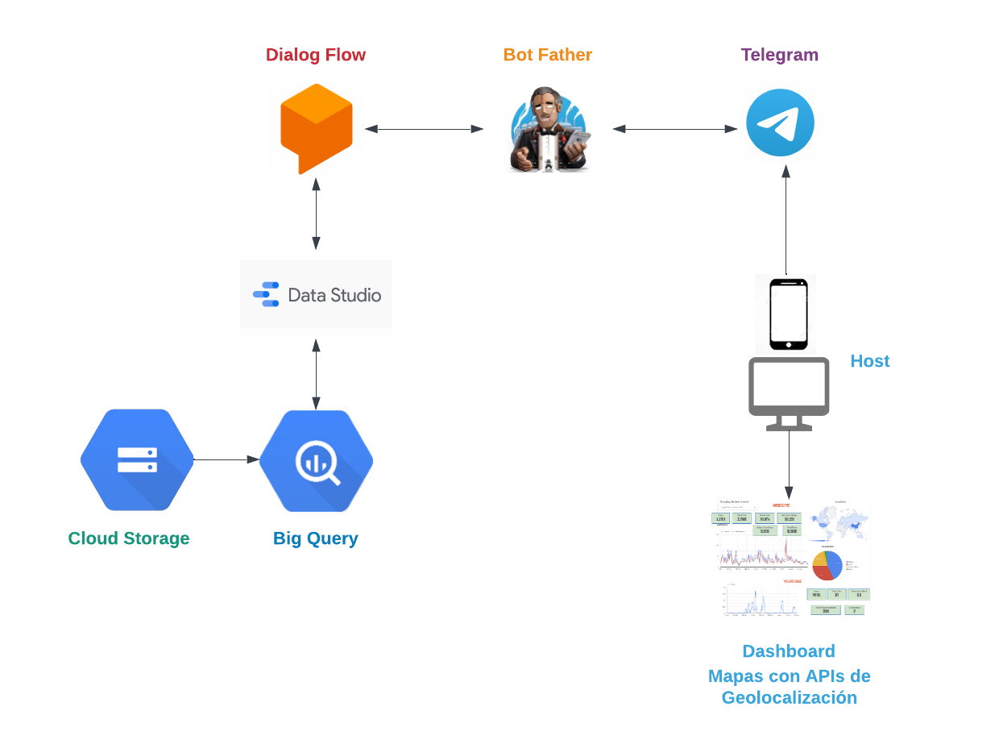

# Hack-BBVA-2022
---
### Descripción: Repositorio para el reto ATM del Hackathon BBVA 2022.

### Equipo: X-Women

### :star: Propuesta
Construir un asistente para dispositivos móviles que brinde información confiable y en tiempo real para identificar los cajeros automáticos que se encuentren disponibles cerca de la ubicación actual del usuario. Lo anterior, con la finalidad de que este pueda acceder a los mismos sin contratiempos, a través una conversación fluida y natural que busque mejorar la experiencia del usuario (UX) al interactuar.

Debido a la alta demanda que suelen tener estas unidades en distintas zonas, existen demoras en el servicio y largos tiempos de espera que afectan la usabilidad de las mismas, de ahí que consideremos la solución planteada anteriormente.

### ⚙️ Descripción Técnica
El asistente se basa en un flujo de diálogo construido mediante DialogFlow, el cual utiliza como base "Intenciones" para detectar las necesidades del usuario, desde un saludo y el querer solicitar información sobre cajeros disponibles. La conversación va dirigida, de tal modo que el mismo usuario brinde datos para saber si es usuario corporativo o no, así como su ubicación para poder filtrar con base en esto la información sobre los cajeros cercanos.

Una vez confirmada su identidad, el asistente brindará un enlace externo a un dashboard generado en Google Data Studio con información relevante respecto a las unidades.

### 🛠️ Herramientas de desarrollo 

El proyecto estará implementando servicios en la nube de Google Cloud Platform (GCP), entre ellas:

+ BigQuery
+ Google Data Studio
+ DialogFlow
+ BotFather API
+ Cloud Storage
+ Integración de APIs para Geolocalización

Las instrucciones para el uso del asistente se encuentran [aquí](../instrucciones-adiutans.md)

---

### ✒️ Autoras

* **Mónica Portillo** - *Web Development, Design, Documentation, Maps Integration* -  [Moni Portillo](https://github.com/monicaps)
* **Estefanía Estrada** - *BigQuery Management and Data Studio, Research* -  [Fany Estrada](https://github.com/FanyEstrada)
* **Elizabeth Lucas** - *BigQuery Management and Research* -  [Lizzy Lucas](https://github.com/LizzyLucas)
* **Alejandra Castillo** - *Documentation, DialogFlow Management, Research* - [Ale Castillo](https://github.com/aleepsy)
* **Jimena Álvarez** - *Research, Science, Documentation* - [Jime Álvarez](https://github.com/5inope)

Made with :heart: by [X-Women](https://github.com/x-women-mx)
